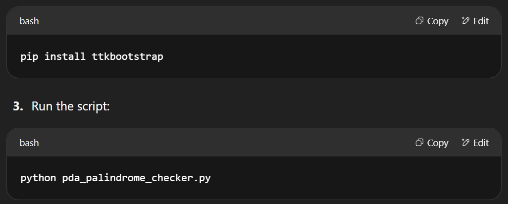

# 🤖 PDA Palindrome Checker (Tkinter + ttkbootstrap)

This is a **graphical Pushdown Automaton (PDA) Palindrome Checker** built using Python's `tkinter` and the stylish `ttkbootstrap` library. It visually demonstrates how a PDA verifies whether a string is a **palindrome** using stack operations, with animation and sound feedback.

---

## 🧰 Tech Stack

- 🐍 Python 3.x
- 🪟 tkinter (GUI framework)
- 🎨 ttkbootstrap (modern styled widgets)
- 🔊 winsound (for audio feedback on Windows)

---

## ✨ Features

- 🔤 Supports **two input modes**:
  - Standard mode: `a` and `b`
  - Numeric mode: digits `0-9`
- ⌨️ **Real-time checking** as the user types
- 📊 **Animated stack simulation** showing:
  - Push and pop operations
  - Mismatches and match status
- 🔉 **Beep sound** on result (✓ / ✗)
- 🌗 **Dark Mode toggle**
- 🧠 **Length analysis**: categorizes input as short, medium, or long
- 📜 **History log** of all checked strings
- 💾 **Export button** to save history to `palindrome_results.txt`
- ❓ Built-in **Help dialog**

---

## 📸 Screenshot

![PDA Palindrome Checker GUI]
 (video/Palindrome_chcker_demo.gif)

🚀 How to Run
Make sure you have Python 3 installed.

Install required packages:

✅ Works on Windows out-of-the-box
🔔 For Mac/Linux, replace winsound with pygame or remove the beep.

🛠 File Structure

pda-palindrome-checker/
│
├── pda_palindrome_checker.py      # Main GUI script
├── palindrome_results.txt         # Output log file (after export)
└── images/                        #  Screenshots for README
